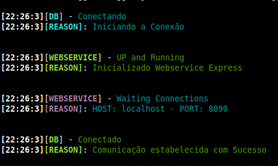
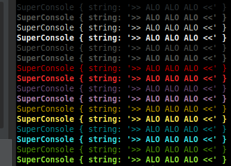
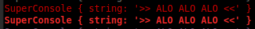
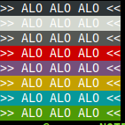

# af-super-console

[](https://github.com/maviniciuus/af-super-console)
[](https://www.npmjs.com/package/af-super-console)
[](https://github.com/maviniciuus/af-super-console)

Utilitário de debug para imprimir mensagens formatadas no console.

## Instalando

`npm i --save af-super-console`

## Iniciando

#### Imprimindo no Console
```js
new SuperConsole('>> ALO ALO ALO <<').log();
```
#### Group LOG
Utilitario para gerar mensagens formatadas no padrão grupo, sem ter que pensar muito!
Types: info, success, error, warning.


```js
SuperConsole.groupLog({
  type: 'info',
  group: 'JOB-SAMPLE',
  message: 'Executando a job X, de 5 em 5 minutos',
  reason: '*/5 * * * *',
});
```

#### Cores


```js
new SuperConsole('>> ALO ALO ALO <<').color('black').log();
new SuperConsole('>> ALO ALO ALO <<').color('white').log();
new SuperConsole('>> ALO ALO ALO <<').color('grey').log();
new SuperConsole('>> ALO ALO ALO <<').color('red').log();
new SuperConsole('>> ALO ALO ALO <<').color('magenta').log();
new SuperConsole('>> ALO ALO ALO <<').color('yellow').log();
new SuperConsole('>> ALO ALO ALO <<').color('cyan').log();
new SuperConsole('>> ALO ALO ALO <<').color('green').log();
```

#### Negrito

```js
new SuperConsole('>> ALO ALO ALO <<').bold();
```

#### Cores Bg


```js
new SuperConsole('>> ALO ALO ALO <<').bg('black').log();
new SuperConsole('>> ALO ALO ALO <<').bg('white').log();
new SuperConsole('>> ALO ALO ALO <<').bg('grey').log();
new SuperConsole('>> ALO ALO ALO <<').bg('red').log();
new SuperConsole('>> ALO ALO ALO <<').bg('magenta').log();
new SuperConsole('>> ALO ALO ALO <<').bg('yellow').log();
new SuperConsole('>> ALO ALO ALO <<').bg('cyan').log();
new SuperConsole('>> ALO ALO ALO <<').bg('green').log();
```

## Versionamento

Versionamento [SemVer](http://semver.org/). Para visualizar as versões disponíveis olhe em: [tags on this repository](https://github.com/maviniciuus/af-super-console/tags). 

## Autor

* **Marcus V. Mendes Gonçalves** - *Desenvolvimento dos protótipos, versão final e testes.* - [maviniciuus](https://github.com/maviniciuus)

## Contribuições

Leia o guia de contribuições: [CONTRIBUTING.md](CONTRIBUTING.md).

## Licença

Esse projeto está licenciado como MIT. Veja mais em [LICENSE.md](LICENSE.md) para detalhes.
